# OceanTune AI — Stage 1 Architecture

## Iterative Agent-Guided vLLM Config Search

Stage 1 is a closed-loop search where four components interact each iteration: the **Planner** proposes a config, the **Executor** benchmarks it, the **Analyst** diagnoses the result, and that diagnosis feeds back into the next Planner call.

```mermaid
flowchart TD
    START([oceantune.py run]) --> CTRL

    CTRL["ControllerAgent\nagents/controller_agent.py\n─────────────────\nOrchestrates the full\nStage 1 → Stage 2 pipeline"]

    CTRL -->|"Iteration 0\nbare minimum VLLMFlags\n(vLLM defaults)"| MONGO_INS

    CTRL -->|"Iteration N > 0\ncall propose_next()" | PLAN

    subgraph STAGE1["Stage 1 — Iterative vLLM Config Search (N generations)"]
        direction TB

        PLAN["PlannerAgent\nagents/planner.py\n─────────────────\nReads: current_best_flags\ncurrent_best_metrics\nsearch_history (last 5)\nanalyst_eval (bottleneck +\nrecommendation)\n\nDetects fitness plateau\nFlags regressions in history\n\nCalls DO Serverless Inference\nto propose next VLLMFlags\n\nFallback: curated variation\nlist if LLM unavailable"]

        PLAN -->|"proposed VLLMFlags\n+ rationale"| MONGO_INS

        MONGO_INS[("MongoDB\ncore/db.py\n─────────────\ninsert_config()\nstatus: pending\nper-session\nfingerprint dedup")]

        MONGO_INS -->|"config_doc"| EXEC

        subgraph EXEC_BOX["ExecutorAgent — agents/executor.py"]
            direction TB
            EXEC["ExecutorAgent\nAcquires GPU slot\n(GPUSlotAllocator)\nAcquires port\n(PortAllocator)"]

            EXEC --> VLLM

            VLLM["VLLMServer\ncore/vllm_server.py\n─────────────────\nLaunches vLLM in Docker\nInjects GPU-profile env vars\nPolls /health until ready\nStreams container logs"]

            VLLM -->|"server healthy\non assigned port"| BENCH

            BENCH["BenchmarkEngine\ncore/benchmark_runner.py\n─────────────────\nConcurrency ramp:\n[1, 2, 4, 8, 16, 32, 64, 128]\nnum_prompts per level\nCollects: p50/p95/p99 latency\nTTFT, TPOT, ITL\ntok/s, req/s, error_rate\nasyncio.wait() — partial\nresults on timeout"]

            BENCH -->|"RampResult\n(per-level metrics)"| LOGA

            LOGA["LogAnalyzer\ncore/log_analyzer.py\n─────────────────\n14 error-class patterns\nOOM / crash detection\nStartup timing\nKV-cache blocks & GB\nGPU memory used"]

            LOGA -->|"LogAnalysis"| MCOL

            MCOL["MetricsCollector\ncore/metrics_collector.py\n─────────────────\nEnrichedMetrics:\n• peak_throughput_tok_s\n• p95_latency_at_peak_ms\n• mean_ttft_ms\n• throughput_per_gb_vram\n• memory_headroom_fraction\nFitness score:\n70% throughput (log-scaled)\n30% latency (inverted)\nPenalties: error rate,\nfailed levels, OOM"]

            MCOL -->|"EnrichedMetrics\n+ fitness_score"| DB_WRITE
        end

        DB_WRITE[("MongoDB\nbenchmark_runs\n─────────────\nflags, levels[]\nenriched_metrics\nraw_metrics\nfitness_score")]

        DB_WRITE -->|"best run for\nthis config"| ANALYST

        ANALYST["AnalystAgent.evaluate_iteration()\nagents/analyst.py\n─────────────────\nSends to DO Serverless Inference:\n• VLLMFlags used\n• Concurrency curve\n  (tok/s vs concurrency)\n• Summary metrics\n• Prior iteration history\n\nReturns:\n• bottleneck: compute | memory\n  | scheduling | unknown\n• diagnosis: why the curve\n  looks the way it does\n• flag_insights: which flags\n  helped or hurt\n• recommendation: one specific\n  parameter change to try next"]

        ANALYST -->|"analyst_eval dict\nbottleneck + recommendation"| CTRL_LOOP

        CTRL_LOOP{"More iterations?\niteration < generations"}
        CTRL_LOOP -->|"yes — pass analyst_eval\nto next propose_next() call"| PLAN
        CTRL_LOOP -->|"no"| WINNER
    end

    WINNER["Best config by fitness_score\nwinner_flags dict\nwinner_fingerprint"]

    WINNER -->|"winner_flags\nas Stage 2 baseline"| STAGE2

    subgraph STAGE2["Stage 2 — Kernel-Level Search"]
        direction LR
        KO["KernelOptimizerAgent\nagents/kernel_optimizer.py\n─────────────────\n10 iterations\nLLM proposes kernel\noverrides on top of\nwinner_flags\n(attention_backend,\nkv_cache_dtype,\nscheduler_delay_factor,\nNVIDIA/AMD-specific flags)"]

        KO -->|"best_kernel_config"| RG
    end

    RG["ReportGenerator\ncore/report_generator.py\n─────────────────\nYAML recipe\nShell script\nMarkdown report"]

    RG --> OUT([storage/results/])

    style STAGE1 fill:#0d1117,stroke:#30363d,color:#e6edf3
    style STAGE2 fill:#0d1117,stroke:#30363d,color:#e6edf3
    style EXEC_BOX fill:#161b22,stroke:#30363d,color:#e6edf3
    style CTRL fill:#1f6feb,stroke:#388bfd,color:#fff
    style PLAN fill:#1a7f37,stroke:#3fb950,color:#fff
    style ANALYST fill:#9e6a03,stroke:#d29922,color:#fff
    style BENCH fill:#6e40c9,stroke:#a371f7,color:#fff
    style MCOL fill:#6e40c9,stroke:#a371f7,color:#fff
    style MONGO_INS fill:#da3633,stroke:#f85149,color:#fff
    style DB_WRITE fill:#da3633,stroke:#f85149,color:#fff
    style WINNER fill:#1a7f37,stroke:#3fb950,color:#fff
    style KO fill:#9e6a03,stroke:#d29922,color:#fff
    style RG fill:#1f6feb,stroke:#388bfd,color:#fff
```



## The Closed-Loop Feedback Signal

The key insight of Stage 1 is that each iteration feeds into the next through two explicit signals:

```
Iteration N:
  ExecutorAgent benchmarks config
        │
        ▼
  AnalystAgent.evaluate_iteration()
        │  reads concurrency curve (tok/s at each level)
        │  diagnoses bottleneck type
        │  makes one concrete flag recommendation
        │
        ▼
  analyst_eval = {
      "bottleneck":       "memory",
      "diagnosis":        "throughput scales to concurrency 64 but flattens,
                           suggesting KV cache fills before GPU compute saturates",
      "flag_insights":    "gpu_memory_utilization=0.90 is leaving 10% VRAM unused;
                           max_num_seqs=256 may be over-allocating sequence slots",
      "recommendation":   "try kv_cache_dtype=fp8 to halve KV memory footprint"
  }
        │
        ▼ passed to next iteration
  PlannerAgent.propose_next(analyst_eval=analyst_eval)
        │  injects analyst diagnosis into LLM prompt
        │  LLM proposes a targeted change addressing the bottleneck
        ▼
  Iteration N+1: new VLLMFlags with kv_cache_dtype=fp8
```

## Fitness Score Formula

`MetricsCollector` computes a single `[0, 1]` fitness score used by the optimizer:

| Component | Weight (throughput mode) | Formula |
|-----------|--------------------------|---------|
| Throughput score | 70% | `log(tok_s / 100) / log(50000 / 100)` — log-scaled |
| Latency score | 30% | `(30000 - p95_ms) / (30000 - 10)` — inverted linear |
| Error rate penalty | — | `−min(50%, error_rate × 50%)` |
| Failed level penalty | — | `−10%` per failed concurrency level |
| OOM/crash penalty | — | `−30%` if errors detected in logs |

## Iteration 0 Baseline

Iteration 0 always runs bare minimum flags (vLLM defaults with no tuning). This establishes:
- A reproducible baseline fitness for the session
- A starting point the planner can improve from
- Early detection of model load / auth / OOM errors before the search invests in bad configs
